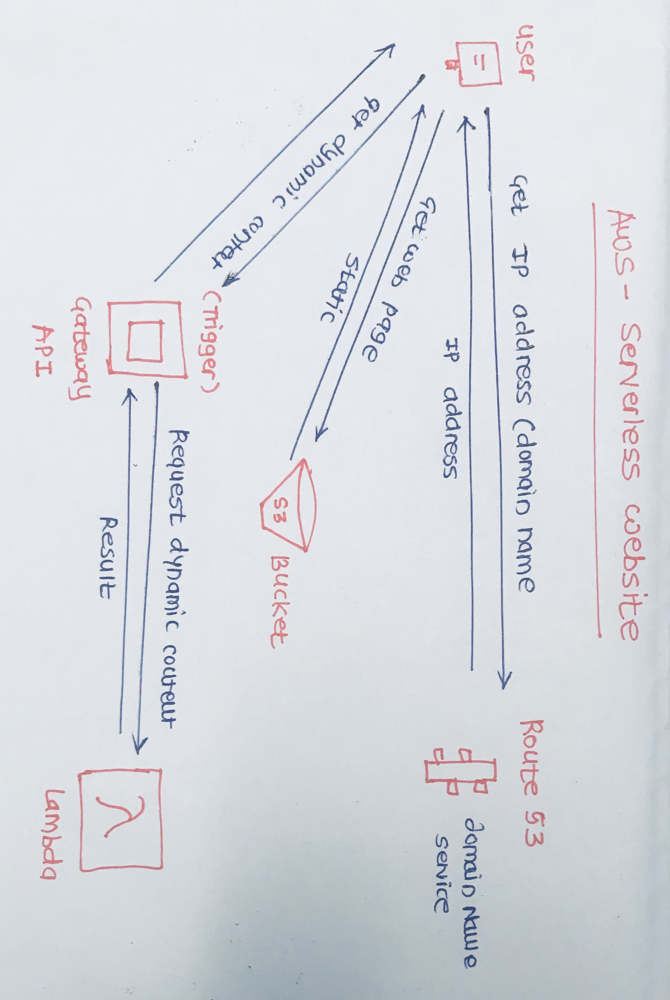

@Author:VinayKhedekar

# AWS-Serverless-Website
Serverless static website, AWS S3 Bucket, Lambda function, API Gateway, Route53

Functionality-

This simple website uses S3 bucket to store the website static content, e.g html pages, images etc.
I have used Lambda function to deliver a dynamic content which is been triggered by the API gateway.
Route53 has been used to get domain name for the website.

Steps -

1. Step 1: Register a Domain (Route 53)
--> Note: Domain name should be same as bucket name

2. Step 2: Create and Configure Buckets and Upload Data
--> Sign in to the AWS Management Console and open the Amazon S3 console
--> Create buckets that match your domain name and subdomain. 
--> Upload your website data to the created bucket.
--> To host a website, your bucket must have public read access.

3. Configure Buckets for Website Hosting
--> Sign in to the AWS Management Console and open the Amazon S3 console 
--> In the Bucket name list, choose the name of the bucket that you want to enable static website hosting for.
    --> Choose Properties.
    --> Choose Static website hosting.
    --> Configure the your bucket for website hosting. In the Index Document box, type the name that you gave your index page.

4. Create Lambda Function

5. Create Trigger - API Gateway
--> Create GET method to read the data stored into the S3 bucket.

